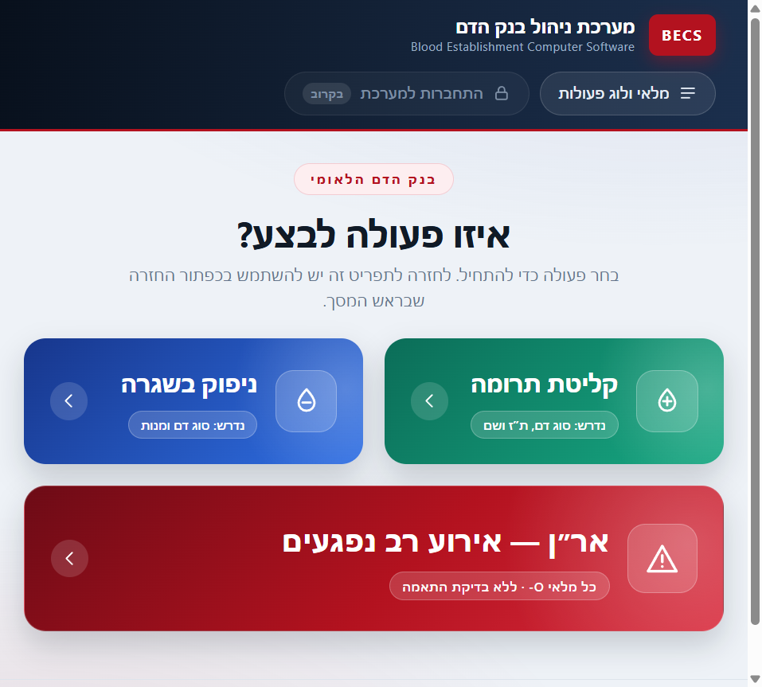
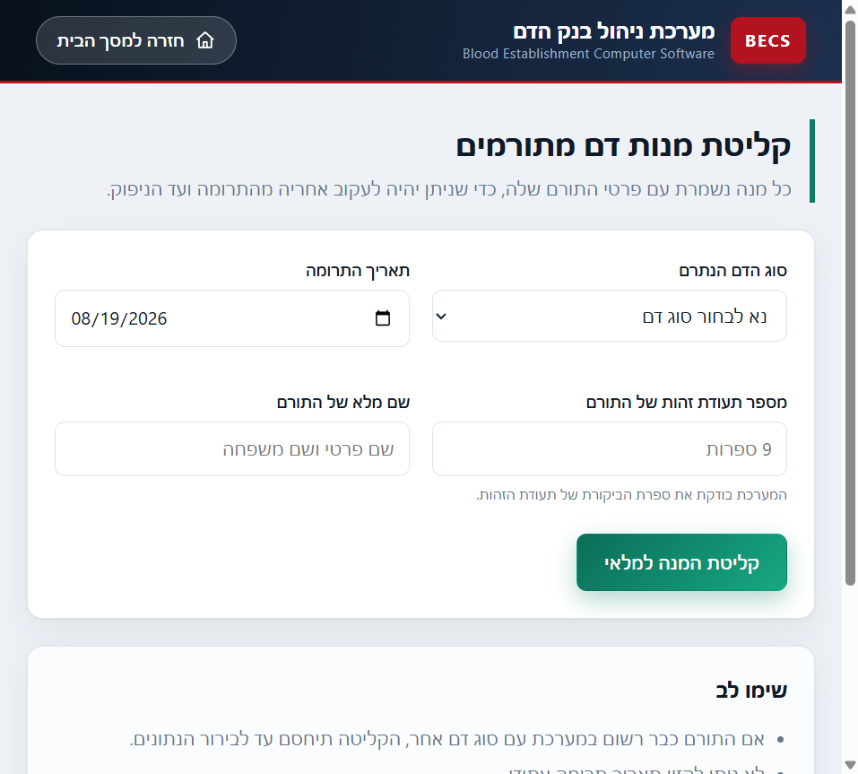
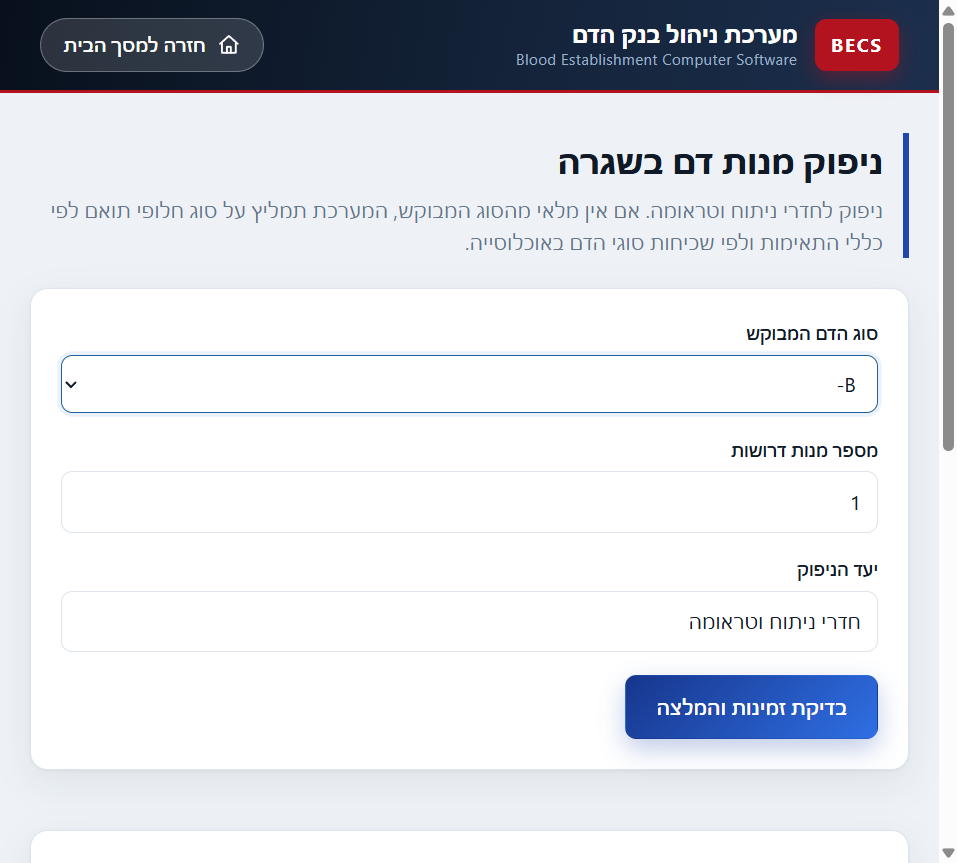
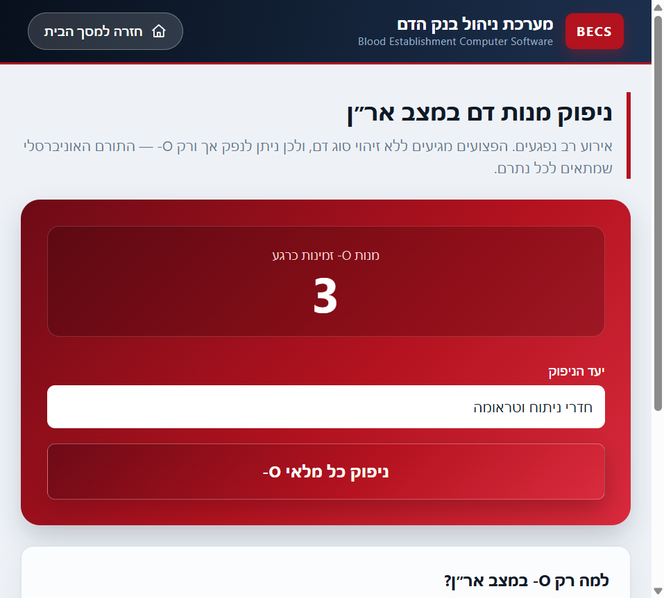
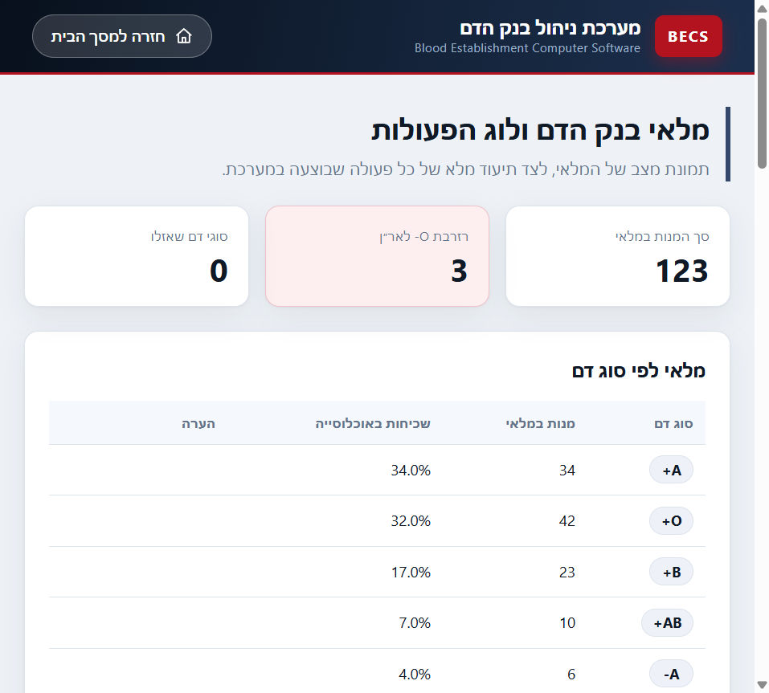
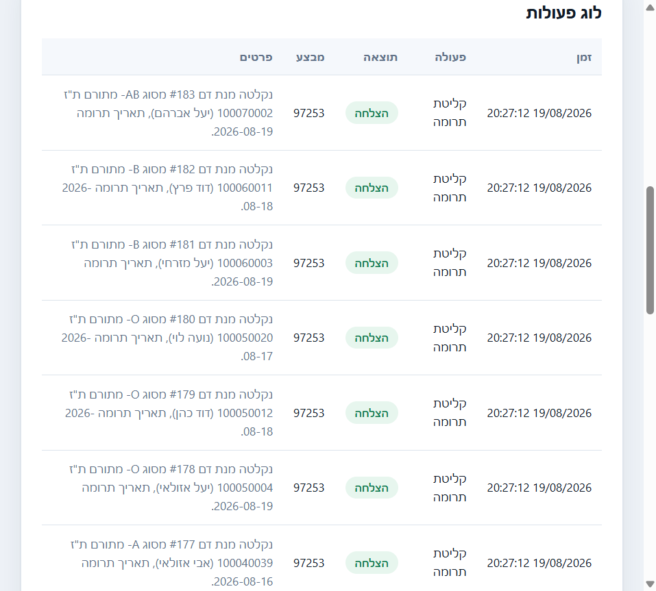
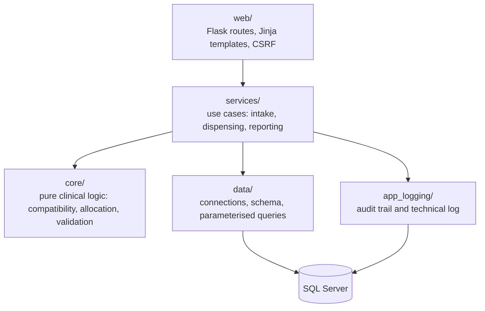

# Blood Bank Management System (BECS)


A **Blood Establishment Computer Software (BECS)** for a national blood service. It tracks
every donated unit from the donor to the operating room, decides which unit to release
using ABO/Rh compatibility rules while protecting the O-negative emergency reserve, and
records every action — including every rejected one — in an audit trail.

Written as an academic assignment, but engineered like software that a hospital would
depend on: a layered architecture where the clinical rules know nothing about the database,
atomic transactions with row locking, defensive validation of every input, and 87 unit tests
covering the decision logic.

> The operator interface is in Hebrew and laid out right to left, because that is the
> language of the blood bank staff it was written for. The Hebrew documentation, including
> the answers to the assignment questions, is in **[README.he.md](README.he.md)**.

---

## Screenshots

**Home screen.** The single entry point. One colour per clinical intent: green adds units to
the bank, blue releases them routinely, red is emergency only. Each button states what the
operator needs at hand before opening the form.



**Donation intake.** Blood type, donation date, donor identity number and full name. The
identity number is checked against the official Israeli check digit, so a typo cannot attach
a unit to the wrong person.



**Routine dispensing.** The operator asks for a blood type and a number of units. The system
answers with a recommendation, substituting compatible types when needed, and shows the
current stock beside the form.



**Mass casualty dispensing.** In a mass casualty event there is no time to type the wounded,
so only O-negative can be released. The screen shows the size of the reserve and nothing else
to decide.



**Inventory and audit trail.** Stock per blood type against its share of the population, with
the O-negative reserve highlighted, and a full log of every action.





---

## Features

- **Donation intake** — validated donor identity, per-unit traceability, and a hard block when
  a returning donor arrives with a blood type that contradicts the one on file.
- **Routine dispensing** — a two-step flow: the system recommends a plan, the operator approves
  it, and only then is stock committed inside a single transaction.
- **Mass casualty dispensing** — releases the entire O-negative reserve in one action, and warns
  that a restock procedure must be started.
- **Partial fulfilment** — when stock cannot cover the request, the system supplies what it can
  and says so explicitly instead of failing silently.
- **Audit trail** — every action is recorded with its timestamp, operator, outcome and details.
  Rejected inputs are recorded too, because an attempt to dispense blood is itself clinical
  information.
- **Reporting** — stock per blood type, recent donations and dispenses, and the audit log, each
  previewed at ten rows and expandable on demand.

---

## The core problem: which unit to release

A recipient can safely receive blood from several types, so an exact match is not always
available and not always the right choice. The allocation logic in `core/allocation.py` follows
three rules, in order:

1. **Exact match first.** The safest option, and it does not consume the stock of another type.
2. **Then the most common compatible type.** A common type is easier to restock, so using it
   costs the bank less.
3. **O-negative always last**, even when it is not the rarest type on the shelf.

The third rule is the interesting one, because it contradicts the second. A recipient with AB-
can receive from A- (4% of the population), O- (3%), B- (2%) and AB- (1%). Sorting by
frequency alone would place O- second and drain the emergency reserve on a routine request, so
an explicit rule pushes it to the end.

**Worked example** — a request for 4 units of AB-, with no AB- in stock:

| Step | Type used | Units | Why |
|---|---|---|---|
| 1 | AB- | 0 | exact match, none in stock |
| 2 | A- | 2 | most common compatible type |
| 3 | B- | 1 | next compatible type by frequency |
| 4 | O- | 1 | last resort, the operator is warned |

Within a single blood type the oldest unit is released first (FIFO), as blood banks do.

---

## Architecture

The dependency direction is the point: the clinical rules are pure Python with no knowledge of
SQL Server or HTTP, which is why they can be tested exhaustively without a database.



| Layer | Responsibility | Knows about |
|---|---|---|
| `core/` | blood types, compatibility, allocation, input validation | nothing but Python |
| `data/` | connections, transactions, schema, every SQL query | the database only |
| `services/` | orchestrates a use case from validation to audit entry | `core`, `data`, `app_logging` |
| `web/` | HTTP endpoints, templates, CSRF protection | `services` |
| `app_logging/` | clinical audit trail in the database, technical log on disk | `data` |

---

## Reliability and security

- **Atomic transactions.** A dispense either happens completely or not at all. Units are locked
  as they are selected (`UPDLOCK, ROWLOCK`), so two operators cannot release the same unit.
- **The plan is recomputed on approval.** The approval step re-runs the allocation against
  freshly locked stock, so a tampered form cannot force an incompatible or oversized release.
- **Concurrency is reported, not hidden.** If another operator took the units mid-transaction,
  the work is rolled back and the operator is asked to repeat the request against real stock.
- **Identity check digit.** Donor identity numbers are verified with the official Israeli
  checksum, because a mistyped digit would attach a unit to the wrong person.
- **Blood type contradictions are refused.** A person's blood type does not change, so a
  returning donor with a different type is treated as an error worth blocking and recording,
  not as an update.
- **Parameterised queries only.** No input is ever concatenated into SQL.
- **CSRF tokens** on every state-changing form, so a dispense cannot be triggered from an
  external page.
- **No secrets in the code.** All configuration comes from environment variables, and the
  default connection uses Windows Authentication, so no password exists to leak.

---

## Data model

| Table | Role |
|---|---|
| `donors` | donors, keyed by identity number |
| `blood_units` | every unit individually, linked to its donor and to its dispense |
| `dispenses` | dispense events, routine or emergency |
| `activity_log` | the audit trail |

**Why store each unit as a row instead of a counter per blood type?** A BECS is regulated
software that must support traceability. If a problem is discovered in one unit, the system has
to answer which donor it came from and where it went. A table constraint enforces that a unit is
either in stock with no dispense attached, or dispensed and attached to exactly one dispense —
there is no in-between state.

---

## Getting started

### Prerequisites

| Component | Tested with |
|---|---|
| Python | 3.11 |
| SQL Server | Express (instance `SQLEXPRESS`) |
| ODBC Driver for SQL Server | 18 |

The ODBC driver usually arrives with SQL Server. On Windows you can confirm it with
`Get-OdbcDriver` in PowerShell.

### Install and run

```powershell
pip install -r requirements.txt
python main.py
```

On the first run the application creates the `BloodBank` database and all of its tables by
itself, then serves the interface at:

```
http://127.0.0.1:5000
```

### Configuration

Copy `.env.example` to `.env` and edit it only if your setup differs from the default. The
default connects to `localhost\SQLEXPRESS` with Windows Authentication, so no password is
stored anywhere.

### Demo data

```powershell
python tools/seed_demo_data.py        # 100 units (default)
python tools/seed_demo_data.py 250    # any other number
```

The tool splits the units across blood types using the same population distribution the
allocation algorithm relies on, so the demo inventory always mirrors a realistic mix.

### Tests

```powershell
python -m pytest
```

---

## Project structure

```
main.py               entry point: logging, database bootstrap, web server
config.py             configuration from environment variables
conftest.py           makes the project root importable for pytest

core/                 pure clinical logic, no I/O
  blood_types.py      the eight blood types and their prevalence in Israel
  compatibility.py    the transfusion compatibility table
  allocation.py       the allocation and dispensing algorithm
  validation.py       input validation, including the identity check digit
  models.py           domain entities
  errors.py           domain errors

data/                 data access
  connection.py       connections and transaction management
  schema.py           database and table creation
  repositories.py     every SQL query

services/             application layer
  donation_service.py donation intake
  dispense_service.py routine and emergency dispensing
  inventory_service.py inventory and log reporting

app_logging/          two log channels
  activity_log.py     clinical audit trail in the database
  app_logger.py       technical log in logs/becs.log

web/                  Flask interface
  routes.py           endpoints
  security.py         CSRF protection
  templates/          Hebrew RTL templates
  static/             stylesheet and the table expand script

tests/                unit tests
tools/                development utilities
docs/                 screenshots
```

---

## Testing

87 unit tests cover the compatibility table, the allocation algorithm, input validation and the
demo data generator.

The most valuable one checks the compatibility table against an **independent rule** rather than
against a copy of itself: a transfusion is safe exactly when the donor carries no antigen the
recipient lacks. Deriving the answer from the antigens means a typo in the lookup table cannot
pass the test by agreeing with itself.

---

## Scope and simplifications

Set by the assignment: the very rare blood types are out of scope, only whole blood is handled
rather than separated components, and units do not expire because they are stored in liquid
nitrogen.

Deliberately not implemented: **authentication**. The login control is present in the interface
but disabled, since roles and permissions were outside the scope of the assignment.

## What I would add next

- Authentication with roles, so the audit trail records a real user instead of the workstation account.
- Unit expiry and a shelf-life report, for a bank that does not use liquid nitrogen storage.
- Integration tests against a disposable test database, alongside the current unit tests.
- A CI workflow running the test suite on every push.
